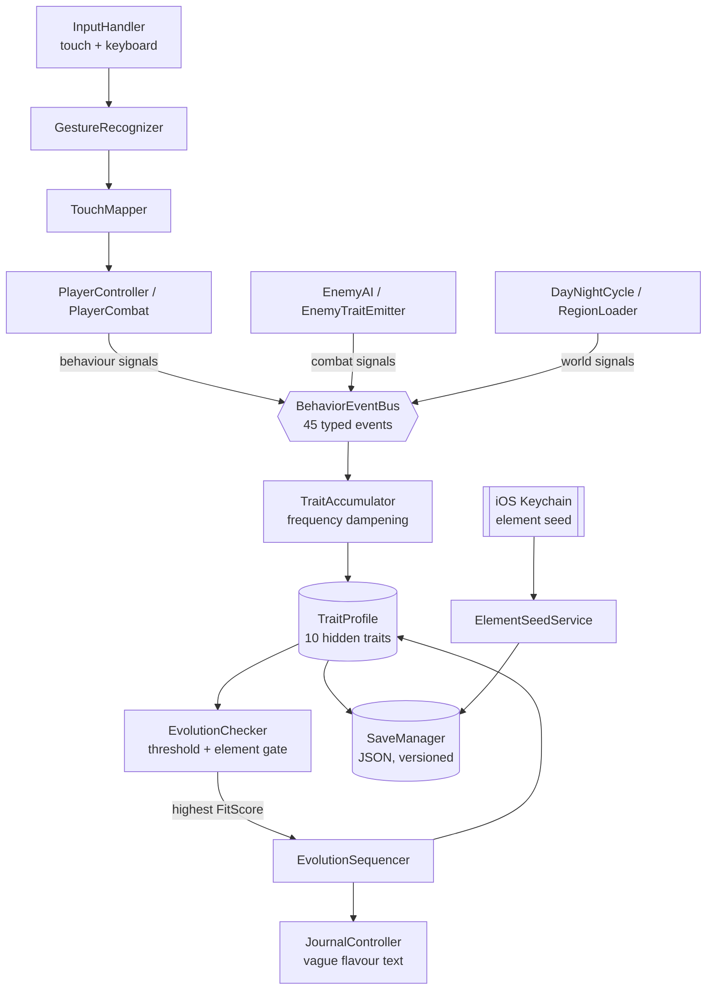

# Project Fenrir

A semi-open-world action RPG for iOS, built in Unity 6 LTS (URP).

*Fate determines your beginning. Choice determines your evolution. Mastery determines your destiny.*

> **Status: work in progress.** This is a solo passion project, built in the
> open. Phase 2 (architecture) is merged; Phase 3 (MVP gameplay) is underway.
> Gameplay currently runs on primitives — capsules and planes — because
> systems are being proven before art goes in. See [Roadmap](#roadmap).

---

## The idea

Most RPGs ask you to pick a class from a menu. Fenrir never asks.

At awakening, the player is assigned an elemental affinity they did not choose.
From then on, **ten hidden traits** silently track *how* they play — whether they
dodge or trade hits, spare creatures or clear rooms, read every lore fragment or
sprint past them. The player is never shown a number or a skill tree.

When a trait profile crosses a threshold that matches an evolution's signature,
the character permanently transforms into a form that reflects how they actually
played. The build is a consequence of behaviour, not a selection.

Tier 1 evolution is **irreversible by design** — the interesting decision is the
one you can't take back.

---

## Why the design is the hard part

Three constraints drive most of the engineering:

**Traits must stay invisible.** No numbers, no progress bars. Feedback is
delivered only through deliberately vague journal entries
(*"The heat no longer frightens you. It feels like a memory."*). This means the
system has to be legible enough to feel fair without ever being shown.

**Grinding must not work.** A player who spams dodge to farm Patience should not
out-earn one who plays naturally. Repeated identical signals decay: the first 5
per session land at full strength, then each additional block of 5 halves the
delta. Behaviour is measured by *pattern*, not volume.

**The seed must be tamper-resistant.** Elemental affinity derives from a seed in
the **iOS Keychain** — never in the save JSON, never synced to iCloud. Deleting
and recreating a character returns the same element. One reroll per slot, ever,
and the flag survives deletion. You cannot reroll your way to a rare element.

---

## Architecture



### Rules the codebase actually enforces

| Rule | Why |
| --- | --- |
| **Service Locator, no singletons** | `ServiceLocator.TryGet<T>` everywhere. One static singleton survived early development and was removed during audit — it had already been made redundant by its own callers. |
| **No `FindObjectOfType` in hot paths** | Scene lookups are cached in `Awake`/`Start`, never queried per-frame. Zero legacy `FindObjectOfType` calls remain. |
| **Typed event bus, concrete keys** | `BehaviorEventBus` keys on concrete type — base-type subscriptions deliberately don't propagate, so a new signal can't silently inherit weights. |
| **No magic numbers** | Every tunable constant lives in `GameConfig`. Trait weights and evolution signatures load from JSON in `StreamingAssets` so balance changes need no recompile. |
| **Deterministic subscription lifecycle** | The bus is cleared *before* scene activation, not after — clearing after activation wiped subscriptions that new-scene objects had just made in `Awake`. Found by audit; see [CHANGELOG](CHANGELOG.md). |

### Death is classified, not just counted

Dying emits one of five distinct events, resolved in priority order, because
*how* a player died says more than *that* they died:

| Type | Condition | Trait effect |
| --- | --- | --- |
| **Ambush** | Died within 5s of combat starting | None — not the player's fault |
| **Pattern failure** | 3rd+ death to the same enemy | Wisdom ↓↓ |
| **Sacrifice** | Attacking below 25% HP, outnumbered or barely scratching the target | Sacrifice ↑ |
| **Reckless** | 3+ unblocked hits, never dodged | Recklessness ↑ |
| **Overwhelmed** | Fallback | Recklessness ↓, Wisdom ↓ |

The ambush case earning *zero* trait shift is the point: a system that punishes
players for unfair deaths teaches them to distrust it.

---

## Tech stack

| Layer | Choice |
| --- | --- |
| Engine | Unity 6 LTS (6000.4.9f1) + URP |
| Language | C# (.NET Standard 2.1) |
| Input | Unity Input System (Enhanced Touch) |
| Physics | PhysX — `CharacterController` for player, NavMesh for AI |
| Persistence | `JsonUtility` → `persistentDataPath`, versioned schema |
| Native | Swift Keychain plugin via `DllImport` |
| Tests | Unity Test Framework (NUnit, EditMode) |
| Target | iOS 16+, ARM64, IL2CPP |

---

## By the numbers

| | |
| --- | --- |
| Runtime C# | ~4,900 lines across 66 files |
| Test coverage | 33 EditMode tests — trait maths, evolution gating, save round-trip, seed determinism |
| Behaviour events | 45 typed signals feeding 10 hidden traits |
| Elements | 15 across 4 rarity tiers (MVP ships the 4 Common) |
| Assembly definitions | 3 — runtime / editor / tests, explicitly referenced |

Tests target the parts where a silent bug is unrecoverable: dampening curves,
evolution eligibility, and save/load fidelity. `SaveManager` takes a path
override specifically so tests never touch real user data.

---

## Repo layout

```text
src/ProjectFenrir/          ← the Unity project (open this in Unity Hub)
  Assets/
    _Project/Scripts/       ← all C# source, namespaced Fenrir.*
      Traits/               ← BehaviorEventBus, TraitAccumulator, TraitProfile
      Evolution/            ← EvolutionChecker, EvolutionSequencer, ShrineController
      Awakening/            ← ElementSeedService, ElementDistribution
      Combat/ Entities/     ← AttackResolver, CombatContext, player + enemy
      Core/                 ← Bootstrap, ServiceLocator, SceneRouter, GameLoop
    _Project/Editor/        ← FenrirSetup — one-command scene provisioning
    StreamingAssets/Config/ ← TraitWeights.json, EvolutionSignatures.json
  Tests/EditMode/           ← NUnit suites
```

Design docs live at the repo root: [GDD](GDD.md) ·
[Architecture](ARCHITECTURE.md) · [Hidden Traits](HIDDEN_TRAIT_SYSTEM.md) ·
[Evolution](EVOLUTION_SYSTEM.md) · [Combat](COMBAT_SYSTEM.md) ·
[World](WORLD_DESIGN.md) · [Awakening](AWAKENING_SYSTEM.md) · [Lore](LORE.md)

Engineering process: [PLAN.md](PLAN.md) is ticket-level source of truth,
[ROADMAP.md](ROADMAP.md) is the phase overview,
[DEVELOPMENT_DIARY.md](DEVELOPMENT_DIARY.md) logs decisions and dead ends.

---

## Running it

Requires Unity 6 LTS (6000.4.9f1) and macOS.

1. Open `src/ProjectFenrir` in Unity Hub.
2. Run **Fenrir → Setup Project** once.
3. Open `EmberForest` and press Play.

Step 2 is a single idempotent editor command that provisions tags, all three
scenes, GameObjects, component wiring, the Cinemachine rig, NavMesh bake, and
build settings — and repairs the URP pipeline reference if it breaks. It
replaced seven separate setup scripts; re-running it is always safe.

**Controls (Editor):** WASD move · Space dodge · J/K light/heavy · L ability ·
B block · Tab journal · F5 quick-save

**Tests:** Window → General → Test Runner → EditMode → Run All.
CI runs documentation linting only — Unity Personal licences cannot activate
headless, so engine tests run locally before every merge. The workflow keeps the
build job stubbed for a future Pro licence rather than pretending to run it.

---

## Roadmap

| Phase | Scope | State |
| --- | --- | --- |
| 0 | Game definition, design docs | ✅ Complete |
| 1 | Repo, Unity project, first playable | ✅ Complete |
| 2 | Architecture — state machines, event bus, combat, save | ✅ Merged |
| 3 | MVP gameplay — awakening ceremony, zones, 5 enemies, boss | 🔄 In progress |
| 4 | Polish — art, animation, VFX, audio, tuning | Planned |
| 5 | Release — TestFlight, App Store submission | Planned |

**Currently building:** character creation UI, element reveal ceremony, and the
Ember Forest zone layout.

**Known rough edges:** gameplay uses placeholder primitives; no PlayMode tests
yet; enemy roster is one Ash Wolf until the prefab pass.

---

## A note on scope

This is one person building an RPG in the open, and the interesting problems are
not the ones a tutorial covers: making a hidden system feel fair, making
irreversible choices feel earned rather than punitive, and keeping an
architecture honest enough that a bug in trait maths is caught by a test instead
of a player.

Everything here is subject to change. That is the point of building in public.

---

## Licence

Source-available, not open-source. © 2026 Sen1F — all rights reserved.
You're welcome to read the code and build it locally to evaluate it; reuse,
redistribution, and derivative works require written permission. See
[LICENSE](LICENSE).
